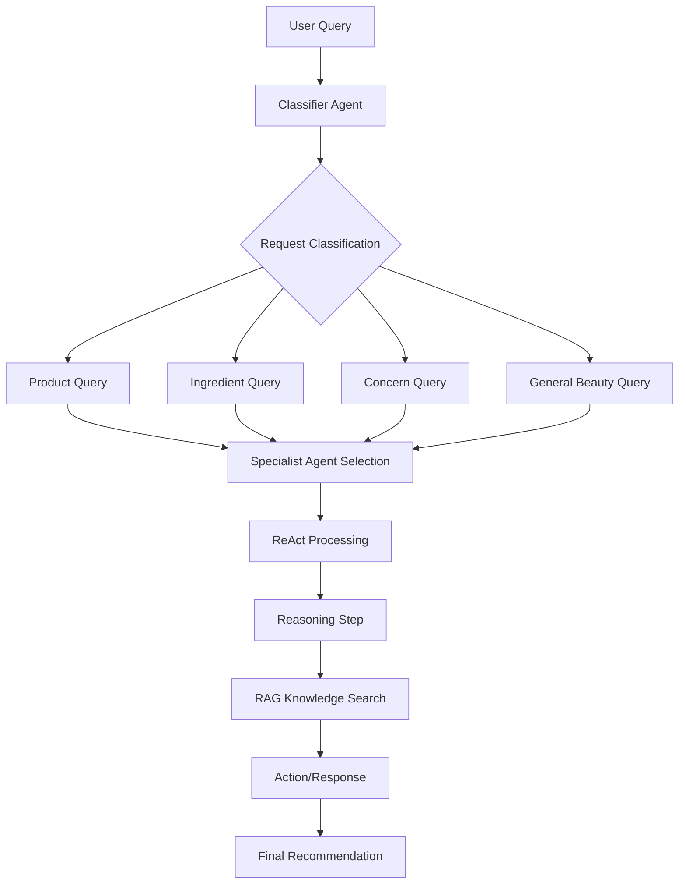

# Multi-Agent Beauty System with Letta

This document describes the multi-agent beauty consultation system built using Letta (the AI operating system for stateful agents). The system implements a ReAct (Reasoning + Acting) architecture with specialized agents for different beauty concerns and RAG capabilities for knowledge retrieval.

## Architecture Overview

### System Components

1. **Classifier Agent** - Routes incoming requests to appropriate specialist agents
2. **Specialized Concern Agents** - Expert agents for specific beauty concerns (acne, aging, sensitivity, etc.)
3. **RAG Integration** - Vertex AI powered knowledge base search
4. **ReAct Framework** - Reasoning and action loops for intelligent decision making

### Agent Hierarchy

```
Multi-Agent Beauty System
├── Classifier Agent (beauty_classifier_agent)
│   └── Routes requests by concern type
├── Specialist Agents
│   ├── Dr. Acne (beauty_acne_agent)
│   ├── Dr. Youth (beauty_aging_agent)
│   ├── Dr. Gentle (beauty_sensitivity_agent)
│   ├── Dr. Hydration (beauty_dryness_agent)
│   ├── Dr. Balance (beauty_oiliness_agent)
│   ├── Dr. Brightening (beauty_hyperpigmentation_agent)
│   └── Dr. Beauty (beauty_general_agent)
└── RAG Knowledge Base
    └── Vertex AI Search Integration
```

## Beauty Concerns Supported

The system supports the following beauty concerns, each with a dedicated specialist agent:

| Concern | Agent | Specialization |
|---------|-------|----------------|
| **Acne** | Dr. Acne | Comedonal, inflammatory, cystic acne; salicylic acid, benzoyl peroxide, retinoids |
| **Aging** | Dr. Youth | Fine lines, wrinkles, elasticity; retinoids, peptides, vitamin C, AHA/BHA |
| **Sensitivity** | Dr. Gentle | Reactive skin, allergies, irritation; hypoallergenic formulations, barrier repair |
| **Dryness** | Dr. Hydration | Dehydration vs dryness; hyaluronic acid, ceramides, glycerin |
| **Oiliness** | Dr. Balance | Sebum control, pore management; niacinamide, zinc, clay, BHA |
| **Hyperpigmentation** | Dr. Brightening | Dark spots, melasma, uneven tone; vitamin C, kojic acid, arbutin |
| **General** | Dr. Beauty | Comprehensive skincare, multi-concern approaches |

## Request Classification

The classifier agent categorizes requests into:

### Request Types
- **Product** - Questions about specific beauty products
- **Ingredient** - Questions about skincare/makeup ingredients  
- **Concern** - Questions about specific skin/beauty concerns
- **General Beauty** - General beauty advice or education

### Processing Flow



## ReAct Architecture Implementation

Each specialist agent follows the ReAct (Reasoning + Acting) methodology:

### 1. Reasoning Phase
- Analyzes user query and context
- Documents thought process using `reasoning_step` tool
- Identifies key concerns and requirements

### 2. Action Phase
- Searches knowledge base using `search_beauty_knowledge_base` tool
- Retrieves relevant product and ingredient information
- Validates recommendations against user's specific needs

### 3. Response Phase
- Synthesizes findings into actionable recommendations
- Provides scientific backing for suggestions
- Includes specific product recommendations where appropriate

### Example ReAct Flow

```python
# Step 1: Reasoning
await reasoning_step(
    thought="User has oily skin and mentions large pores and shine",
    action_needed="Search for oil-controlling ingredients and pore-minimizing products"
)

# Step 2: Action - RAG Search
results = await search_beauty_knowledge_base(
    query="niacinamide oil control pore minimizing",
    concern_type="oiliness"
)

# Step 3: Reasoning - Synthesis
await reasoning_step(
    thought="Found several effective ingredients: niacinamide, clay, BHA",
    action_needed="Recommend specific products with these ingredients"
)

# Step 4: Response Generation
# Agent provides comprehensive recommendation with product suggestions
```

## RAG (Retrieval-Augmented Generation) Integration

### Knowledge Base Structure

The system uses a simulated Vertex AI RAG setup with knowledge organized by concern:

```python
knowledge_base = {
    "acne": [
        "Salicylic acid is effective for unclogging pores and reducing acne inflammation",
        "Benzoyl peroxide kills acne-causing bacteria but can be drying",
        "The Ordinary Salicylic Acid 2% is a budget-friendly option for acne treatment"
    ],
    "aging": [
        "Retinoids are the gold standard for anti-aging skincare",
        "Vitamin C provides antioxidant protection and stimulates collagen",
        "CeraVe Resurfacing Retinol Serum is well-tolerated for beginners"
    ],
    # ... more concerns
}
```

### RAG Search Process

1. **Query Processing** - Analyzes search terms and concern context
2. **Knowledge Retrieval** - Finds relevant information from knowledge base
3. **Confidence Scoring** - Assigns confidence scores to results
4. **Recommendation Extraction** - Identifies specific product recommendations

## API Endpoints

### Multi-Agent Processing

#### `POST /api/v1/letta/multi-agent/process`
Process a beauty query through the complete multi-agent system.

**Request:**
```json
{
  "query": "I have terrible acne, what should I do?",
  "force_concern": null,
  "include_reasoning": true
}
```

**Response:**
```json
{
  "classification": {
    "request_type": "concern",
    "beauty_concern": "acne",
    "confidence": 0.9,
    "reasoning": "User mentioned acne specifically",
    "suggested_agent": "beauty_acne_agent"
  },
  "specialist_response": {
    "agent_id": "agent-acne-123",
    "concern": "acne",
    "response": {...},
    "reasoning_steps": [...],
    "recommendations": [...]
  },
  "pipeline": "multi_agent_react",
  "total_processing_time": 2.3,
  "agents_involved": ["beauty_classifier_agent", "beauty_acne_agent"]
}
```

### System Management

#### `GET /api/v1/letta/multi-agent/status`
Get current system status and available agents.

#### `POST /api/v1/letta/multi-agent/initialize`
Initialize or reinitialize the complete agent system.

#### `GET /api/v1/letta/multi-agent/concerns`
Get list of available beauty concerns and request types.

### RAG Search

#### `POST /api/v1/letta/rag/search`
Direct search of the beauty knowledge base.

**Request:**
```json
{
  "query": "best ingredients for acne",
  "concern_type": "acne",
  "max_results": 5
}
```

## Configuration

### Environment Variables

```bash
# Letta Configuration
LETTA_BASE_URL=http://localhost:8283  # Self-hosted Letta server
OPENAI_API_KEY=your_openai_key        # For GPT models
ANTHROPIC_API_KEY=your_anthropic_key  # For Claude models (optional)
GEMINI_API_KEY=your_gemini_key        # For Gemini models (optional)

# Vertex AI Configuration (for production RAG)
GOOGLE_CLOUD_PROJECT=your_project_id
VERTEX_AI_LOCATION=us-central1
VERTEX_SEARCH_ENGINE_ID=your_search_engine_id
```

### Agent Configuration

Agents are configured with:
- **Model**: `openai/gpt-4.1` (recommended for reasoning capabilities)
- **Embedding**: `openai/text-embedding-3-small`
- **Tools**: `["web_search", "run_code"]` + custom RAG tools
- **Memory Blocks**: `human`, `persona`, `context` (for ReAct state)

## Usage Examples

### Python Client

```python
from app.agents.letta import process_beauty_request

# Process a beauty query
result = await process_beauty_request(
    "My skin is very dry and I have fine lines appearing. What routine should I follow?"
)

print(f"Classified as: {result['classification']['beauty_concern']}")
print(f"Specialist response: {result['specialist_response']['response']}")
```

### HTTP API

```bash
# Initialize the system
curl -X POST "http://localhost:8000/api/v1/letta/multi-agent/initialize" \
  -H "Content-Type: application/json" \
  -d '{"force_recreate": false}'

# Process a beauty query
curl -X POST "http://localhost:8000/api/v1/letta/multi-agent/process" \
  -H "Content-Type: application/json" \
  -d '{
    "query": "I have sensitive skin that breaks out easily. What products should I avoid?",
    "include_reasoning": true
  }'
```

## Testing

The system includes comprehensive tests covering:

- **Unit Tests** - Individual agent functionality
- **Integration Tests** - End-to-end processing flows
- **Error Handling** - Fallback mechanisms and error recovery
- **Agent Specialization** - Concern-specific behavior validation

Run tests with:
```bash
pytest tests/test_multi_agent_system.py -v
```

## Production Deployment

### Vertex AI RAG Setup

For production, replace the simulated RAG with real Vertex AI Search:

1. **Create Search Engine** in Google Cloud Console
2. **Upload Knowledge Base** with beauty/skincare content
3. **Update Configuration** with engine IDs and credentials
4. **Implement Real RAG Client** in `vertex_ai_tools.py`

### Scaling Considerations

- **Agent Caching** - System caches agent IDs to reduce initialization overhead
- **Memory Management** - Agents maintain conversation context automatically
- **Load Balancing** - Consider multiple Letta server instances for high traffic
- **Monitoring** - Track agent performance and user satisfaction metrics

## Future Enhancements

### Planned Features

1. **Tool Rules** - Implement Letta tool rules for workflow constraints
2. **Multi-Agent Communication** - Cross-agent collaboration for complex queries
3. **Sleep-time Agents** - Background processing for memory optimization
4. **External Integrations** - MCP servers, Composio tools, custom APIs
5. **Advanced RAG** - Hybrid search, semantic chunking, multi-modal content

### Model Improvements

- **Fine-tuned Models** - Custom models trained on beauty/skincare data
- **Multimodal Capabilities** - Image analysis for skin condition assessment
- **Personalization** - User-specific agent memory and preferences

## Support and Documentation

- **Letta Documentation**: [https://docs.letta.com/](https://docs.letta.com/)
- **API Reference**: See `/api/v1/letta/` endpoints
- **Discord Community**: [Letta Discord](https://discord.gg/letta)
- **GitHub Repository**: [letta-ai/letta](https://github.com/letta-ai/letta)

---

This multi-agent system demonstrates the power of Letta for building sophisticated, stateful AI applications with specialized domain expertise and intelligent orchestration. 